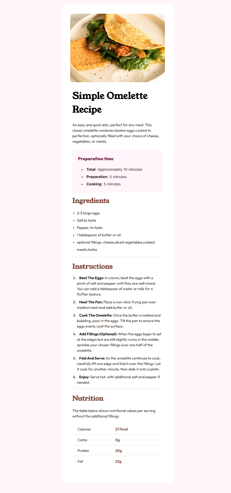

# Frontend Mentor - Recipe page solution

This is a solution to the [Recipe page challenge on Frontend Mentor](https://www.frontendmentor.io/challenges/recipe-page-KiTsR8QQKm). Frontend Mentor challenges help you improve your coding skills by building realistic projects.

### Screenshot

Add a screenshot of your solution. The easiest way to do this [is](https://www.awesomescreenshot.com/blog/screenshot/chrome-full-page-screenshot)

### Links

- Live Site URL: [Add live site URL here](https://your-live-site-url.com)

### Built with

- HTML5 markup
- CSS custom properties
- Flexbox
- CSS Grid
- Mobile-first workflow
- [Gulp](https://github.com/ubeysaab/FullStackDevelopment__2024/tree/main/Gulp)
- [SASS](https://github.com/ubeysaab/FullStackDevelopment__2024/tree/main/SASS)
